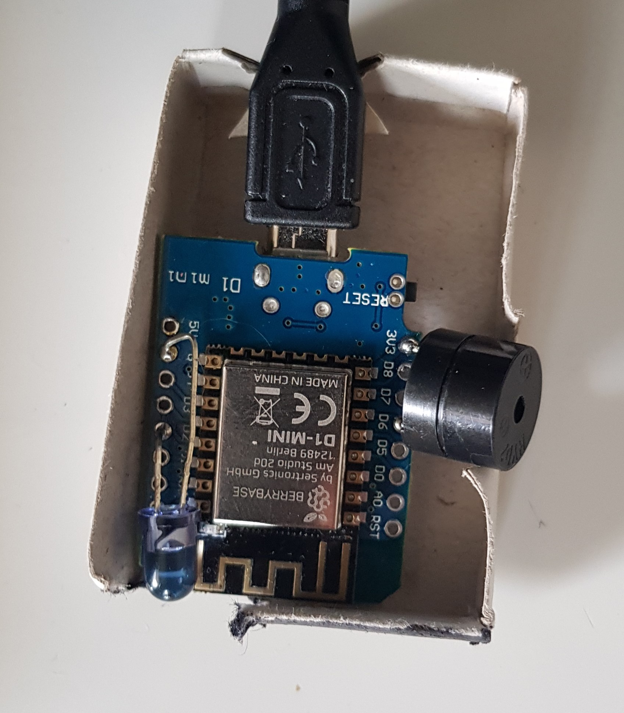

# ESP8266 IR Remote

This is very simple ESP8266 project I build with a WEMOS/LOLIN D1 mini to control my Pioneer TV over MQTT with HomeAssistant, NodeRed, NFC, my smartphone or some other devices like a spare Ikea Tradfri light switch. It's based on [crankyoldgit's IRremoteESP8266](https://github.com/crankyoldgit/IRremoteESP8266) where you'll most likely also find your TV manufacturer.

Basically I just added a IR LED directly to pin D2 and 3V3 (even though a resistor might be recommended, I skipped that part because I wanted the LED extra bright ... let's see how long it lasts).



(_Optional_) I also added an active buzzer between D6 and GND to have something in my living room for simple audio feedback. This way a melody will let me know for sure wether my light switch is in the mode for controlling the TV or my Sonos or whatever.

The final result fits perfectly in a match box.

## Requirements

- a MQTT server like mosquitto (with websocket support, if you want to use the remote via the included web server)
- ESP8266
- IR LED
- _(optional)_ active buzzer
- VS Code
- the PlatformIO plugin

## Build

Flash the ESP8266 in the `PlatformIO Projekt Tasks` -> `d1 mini` -> `General` -> `Upload` or press <kbd>Ctrl</kbd> + <kbd>Alt</kbd> + <kbd>U</kbd>.

Upload necessary files from the `data` directory in `PlatformIO Projekt Tasks` -> `d1 mini` -> `Platform` -> `Upload Filesystem Image`.

## Configuration

To pre-configure your ESP8266 copy the `data.config.example.json` file to `data/config.json` and edit the following properties:

```json
{
  "name": "ESP-IR-Remote_...", // optional
  "mqttBroker": "local.broker",
  "mqttPort": "1883",
  "mqttPortWS": "9001",
  "mqttTopicBuzzer": "home/tv-remote/buzzer",
  "mqttTopicCommand": "home/tv-remote/command"
}
```

Then (again) upload the files in `PlatformIO Projekt Tasks` -> `d1 mini` -> `Platform` -> `Upload Filesystem Image`.

Alternatively you can use the WifiManager to set the properties after the first launch. If you want to edit the properties later again double reset the ESP8266 within four seconds to reset the WifiManager.

## WifiManager

To set the Wifi credentials power up the ESP8266 and connect to the newly created Access Point called ESP${CHIP_ID}. Open [http://192.168.4.1](http://192.168.4.1) to access the configuration page. Further you can change the MQTT settings. Submit your changes to save them to `config.json`.

## MQTT server configuration

If you're using mosquitto open your `mosquitto.conf` file and add the following lines to add the required websocket listener.

```conf
listener 9001
protocol websockets
```

## MQTT message examples

### IR Remote

#### Power on/off

shell

```sh
mosquitto_pub -h local.broker -t home/tv-remote/command -m '{"addr": 0,"cmd": 43548}'
```

payload

```json
{
  "addr": 0,
  "cmd": 0xaa1c
}
```

#### Input 3

shell

```sh
mosquitto_pub -h local.broker -t home/tv-remote/command -m '{"addr": 43610,"cmd": 44924}'
```

payload

```json
{
  "addr": 0xaa5a,
  "cmd": 0xaf7c
}
```

The IR codes can be found on the Pioneer homepage: [https://www.pioneerelectronics.com/pio/pe/images/portal/cit_3424/319012430PDP4270HD_IR.pdf](https://www.pioneerelectronics.com/pio/pe/images/portal/cit_3424/319012430PDP4270HD_IR.pdf)

### Buzzer

#### play some notes

shell

```sh
mosquitto_pub -h local.broker -t home/tv-remote/buzzer -m '{ "buzz": [{ "f": 330, "d": 500 }, { "f": 440, "d": 500 }, { "f": 262, "d": 1000 }, { "f": 0, "d": 50 }, { "f": 523, "d": 50 }, { "f": 0, "d": 50 }, { "f": 523, "d": 50 }, { "f": 0, "d": 50 }, { "f": 523, "d": 50 }]}'
```

payload

```json
{
  "buzz": [
    { "f": 330, "d": 500 }, // f=frequency, d=duration
    { "f": 440, "d": 500 },
    { "f": 262, "d": 1000 },
    { "f": 0, "d": 50 }, // f: 0 obviously is a pause
    { "f": 523, "d": 50 },
    { "f": 0, "d": 50 },
    { "f": 523, "d": 50 },
    { "f": 0, "d": 50 },
    { "f": 523, "d": 50 }
  ]
}
```

## Web Server

After you configured the Wifi and the ESP can connect to the network, you'll be able to access it's web server by entering the IP of the device in your browser. There you'll find examples of all buttons for testing and see a log of the latest messages returned by your MQTT server if configured correct.
